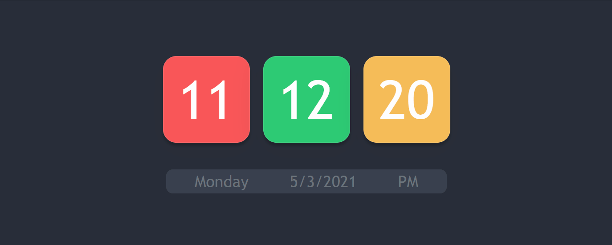

# Digital-Clock
## Digital Clock with Date and Day
#### Visit the app by clicking this [Modern Clock](https://moderndigitalclock.netlify.app/)


#### Feel free to change or customize as much as you want
#### It sound awesome if you have a much better ideas to improve this
#### Do contribute and share your ideas with all other developers so that they can take advantage of your customization

Languages
================
- HTML
- CSS
- JavaScript

Base Design and Styling
================
In `index.html` you can get the base design of the clock

For styling i have used Bootstrap and custom styling you can get the CSS code from `style.css` file

JavaScript Code
================

In `clock.js` file you can get the Javascript code
`clock.js` have 3 main sections

- `tick()` function
- `getDayName()` fucntion
- `setInterval()` method

#### `tick()` fucntion :

```js
const tick = () =>{
    const current = new Date();
    
    let ss =current.getSeconds();
    let mm = current.getMinutes()
    let hh = current.getHours();
    let meridiem = 'AM';
    let currentDay = current.getDay();

}
```
new `Date()` creates a date object with the current date and time\
In our fucntion `getSeconds();` will return current seconds\
`getMinutes()` will return current Minutes , `getDay()` will return the current weekday in number\

As we are dealing with 12-hour format we need to add some condition for converting of current 24-hour to 12-hour format.

```js

    if(hh === 00){
        hh = 12
        meridiem = 'AM';
    }
    else if( hh === 12 ){
        meridiem = 'PM';
    }
    else if( hh > 12){
        hh = hh - 12
        meridiem = 'PM';
    }

```
As you know, we are creating a digital clock in a 12-hours. format.\
A 12-hour digital clock includes meridiem (AM/PM). So we need to add meridiem with the time.\
initially we will set meridiem to 'AM'

```js
const meridiem = 'AM'
```

After this we need to render our current time on the screen.
To do this we will change the `textContent` of our elements which we defined in our HTML file.\
before rendering the time we need to ensure one thing, that time must be displayed in 2-digits format, when it will be less than 10.

```js
    hours.textContent = `${hh<10? `0${hh}`:hh}`;
    minutes.textContent =`${mm<10? `0${mm}`:mm}`;
    seconds.textContent =`${ss<10? `0${ss}`:ss}`
    checkMeridiem.textContent = meridiem;
    date.textContent = current.toLocaleDateString();
```
In the above code, we have a new method `toLocaleDateString()` which will return the current date in D/M/YYYY format.
To show the current day of a week we need to define a function

```js
const getDayName = (value) =>{
    const DayNames = [
        'Sunday',
        'Monday',
        'Tuesday',
        'Wednesday',
        'Thursday',
        'Friday',
        'Saturday'
    ]
    return DayNames[value];
}
```
this function will get an argument named as value which will be an integer value.\
Inside this function, we have to define an array of names of days of a week and this function will\
return the day_name corresponding to the argument passed to the function.\

Now our last task is to continuously call our tick() function because we want to increment our time on every clock second.\

To do this we have to use a build-in JavaScript method named `setInterval()` which executes a function at specified intervals in milliseconds\
setInterval method gets two arguments. One is function_name and the other is time in milliseconds(1000 milliseconds = 1 second).
```js
setInterval(tick,1000)
```
Now let's arrange the complete code

```js
const tick = () =>{
    const current = new Date();

    let ss =current.getSeconds();
    let mm = current.getMinutes()
    let hh = current.getHours();
    let meridiem = 'AM';
    let currentDay = current.getDay();


    //Converting the 24 hours formate into 12 hour formate 
    if(hh === 00){
        hh = 12
        meridiem = 'AM';
    }
    else if( hh === 12 ){
        meridiem = 'PM';
    }
    else if( hh > 12){
        hh = hh - 12
        meridiem = 'PM';
    }


    hours.textContent = `${hh<10? `0${hh}`:hh}`;
    minutes.textContent =`${mm<10? `0${mm}`:mm}`;
    seconds.textContent =`${ss<10? `0${ss}`:ss}`
    checkMeridiem.textContent = meridiem;
    date.textContent = current.toLocaleDateString();
    day.textContent = getDayName(currentDay);

}

const getDayName = (value) =>{
    const DayNames = [
        'Sunday',
        'Monday',
        'Tuesday',
        'Wednesday',
        'Thursday',
        'Friday',
        'Saturday'
    ]
    return DayNames[value];
}


setInterval(tick,1000)
```
Our digital clock is ready !
